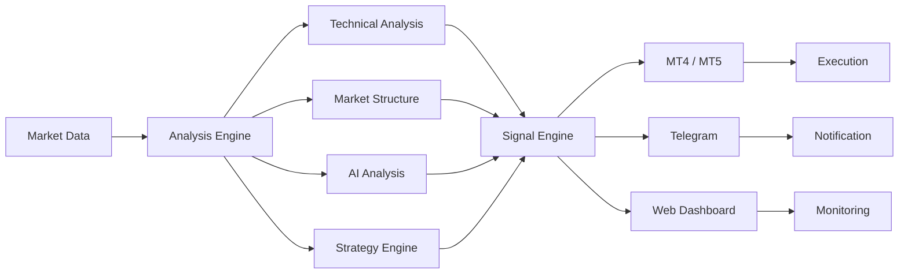

# 👾 MONSTER TRADER

<div align="center">


<br>


</div>

---

## 🧬 `SYSTEM.IDENTITY`

```text
┌──────────────────────────────────────────────────────────────┐
│                    MONSTER TRADER // CORE                    │
├──────────────────────────────────────────────────────────────┤
│                                                              │
│  ROLE        → Forex Trader & Software Developer             │
│  SPECIALTY   → Algorithmic Trading & AI Automation           │
│  STACK       → Python • MQL4 • MQL5 • JavaScript             │
│  ECOSYSTEM   → MT4 • MT5 • Telegram • Web                   │
│  FOCUS       → Trading Systems • Bots • Indicators           │
│  MISSION     → Build intelligent tools for modern markets    │
│                                                              │
└──────────────────────────────────────────────────────────────┘
```

> **I don't just analyze markets — I build systems around them.**

---

# ⚡ ABOUT ME

I'm a **Forex Trader, MQL Programmer, and AI/Automation Developer** focused on building practical trading technology.

My work combines:

* 📈 Algorithmic trading
* 🤖 AI-assisted market analysis
* 🧠 Trading strategy automation
* 💻 MQL4 / MQL5 development
* 🐍 Python automation
* 📡 Telegram trading bots
* 🌐 Trading dashboards & web interfaces
* 🔌 API integrations
* 📊 Market-data processing

I enjoy turning trading concepts into **automated, configurable and scalable software systems**.

---

# 🧠 CURRENTLY BUILDING

```yaml
projects:

  MONSTER_TRADING:
    type: "Trading Technology Ecosystem"
    focus:
      - Trading automation
      - AI market analysis
      - Telegram integration

  MARKET_KILLER:
    type: "MT4 Trading System"
    technologies:
      - MQL4
      - Technical Analysis
      - Market Structure
      - Signal Automation

  MONSTER_ALPHA_AI:
    type: "AI Trading Assistant"
    technologies:
      - Python
      - Telegram Bot API
      - AI Analysis
      - Trading Automation

  TRADING_DASHBOARDS:
    type: "Web Applications"
    technologies:
      - HTML
      - CSS
      - JavaScript
      - APIs
      - Charts
```

---

# 🛠️ TECHNOLOGY MATRIX

### Programming

<p align="left">


</p>

### Trading Development

```text
MQL4        ████████████████████  Expert
MQL5        ██████████████████░░  Advanced
Python      ███████████████████░  Advanced
JavaScript  ████████████████░░░░  Intermediate+
PHP         ██████████████░░░░░░  Intermediate
```

### Platforms & Tools

<p align="left">


</p>

```text
MetaTrader 4        → ████████████████████
MetaTrader 5        → ██████████████████░░
Telegram Bots       → ███████████████████░
REST APIs           → ████████████████░░░░
Web Applications    → ███████████████░░░░░
AI Integration      → ████████████████░░░░
```

---

# 🧪 TRADING TECHNOLOGY



---

# 🤖 WHAT I BUILD

| System                | Purpose                     | Technologies         |
| --------------------- | --------------------------- | -------------------- |
| 📊 MT4 Indicators     | Market analysis & signals   | MQL4                 |
| ⚙️ Expert Advisors    | Trading automation          | MQL4 / MQL5          |
| 🤖 Telegram Bots      | Signals & automation        | Python               |
| 🧠 AI Assistants      | Market analysis             | Python + AI          |
| 📡 Signal Connectors  | MT → Telegram communication | MQL + APIs           |
| 🌐 Trading Dashboards | Monitoring & analytics      | HTML / JS            |
| 🔌 API Systems        | Broker/data integration     | Python / PHP         |
| 📈 Chart Tools        | Visualization & analysis    | JS / Chart libraries |

---

# 🚀 FEATURED PROJECTS

## 💀 MARKET KILLER

> Advanced MT4 trading technology built around automated market analysis and configurable signal systems.

**Core concepts**

```text
✓ Technical Analysis
✓ Market Structure
✓ Signal Detection
✓ Telegram Alerts
✓ Chart Analysis
✓ Trading Dashboard
✓ Configurable Parameters
✓ Automation
```

---

## 🤖 MONSTER ALPHA AI

> AI-focused trading assistant ecosystem designed around market analysis, signals and automation.

```text
AI ANALYSIS
     ↓
MARKET DATA
     ↓
STRATEGY ENGINE
     ↓
SIGNAL GENERATION
     ↓
TELEGRAM / DASHBOARD
```

---

## 📡 TELEGRAM TRADING AUTOMATION

Building Telegram-based systems for:

```text
MT4 / MT5
   │
   ├── Signal Detection
   ├── Result Tracking
   ├── Notifications
   ├── Chart Images
   └── Automated Messaging
          │
          ▼
      TELEGRAM BOT
```

---

# 📊 GITHUB ANALYTICS

<div align="center">


</div>

---

# 🔥 CONTRIBUTION ACTIVITY

<div align="center">


</div>

---

# 🐍 CONTRIBUTION SNAKE

<div align="center">


</div>

> The snake animation requires a GitHub Actions workflow to generate the SVG.

---

# 🧩 DEVELOPMENT PHILOSOPHY

```python
class MonsterTrader:

    def __init__(self):
        self.mindset = "BUILD"
        self.learning = True
        self.automation = True
        self.experiments = "CONTINUOUS"

    def workflow(self):
        return [
            "Research",
            "Design",
            "Develop",
            "Backtest",
            "Optimize",
            "Deploy",
            "Monitor"
        ]

    def mission(self):
        return "Turn ideas into working systems."
```

---

# 📡 SYSTEM STATUS

```text
┌─────────────────────────────────────────────┐
│              MONSTER SYSTEM                 │
├─────────────────────────────────────────────┤
│                                             │
│  [✓] Trading Development       ONLINE       │
│  [✓] MQL Development           ONLINE       │
│  [✓] Python Automation         ONLINE       │
│  [✓] Telegram Systems          ONLINE       │
│  [✓] AI Experiments            ACTIVE       │
│  [✓] Web Development           ACTIVE       │
│  [∞] Learning                  RUNNING      │
│                                             │
└─────────────────────────────────────────────┘
```

---

# 🎯 ROADMAP

```text
2026
 │
 ├── ██████████  Advanced MT4/MT5 Systems
 │
 ├── █████████░  AI Trading Assistants
 │
 ├── ████████░░  Automated Telegram Ecosystem
 │
 ├── ███████░░░  Trading Analytics
 │
 ├── ██████░░░░  Web Trading Platforms
 │
 └── █████░░░░░  Advanced AI Integration
```

---

# 🌐 CONNECT

<div align="center">

<a href="https://github.com/MonstarTrader0">

</a>

<a href="https://t.me/Monstar_Trader">

</a>

</div>

---

# 💬 PHILOSOPHY

<div align="center">

### `CODE. ANALYZE. AUTOMATE. EVOLVE.`

**Build systems. Test ideas. Learn continuously.**

</div>

---

<div align="center">

```text
╔══════════════════════════════════════════════╗
║                                              ║
║             MONSTER TRADER                   ║
║                                              ║
║       TRADING × CODE × AI × AUTOMATION       ║
║                                              ║
╚══════════════════════════════════════════════╝
```

⭐ **If you find my projects useful, consider starring the repository.**

</div>
