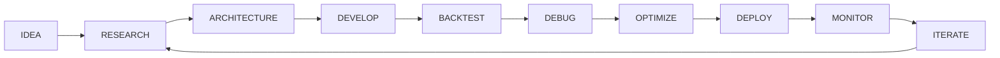

<!--
╔══════════════════════════════════════════════════════════════════════╗
║                 MONSTER TRADER // PROFILE OS                       ║
║                 NEXT-GENERATION EDITION                            ║
║                 GitHub: MonstarTrader0                              ║
║                 Telegram: @Monstar_Trader                           ║
╚══════════════════════════════════════════════════════════════════════╝

PROFILE REPOSITORY:
MonstarTrader0/MonstarTrader0

IMPORTANT:
This README is designed for GitHub Profile README rendering.
No JavaScript, custom CSS, iframe, or unsupported HTML is required.
-->

<div align="center">


<br>


<br><br>

<a href="https://github.com/MonstarTrader0">

</a>

<a href="https://t.me/Monstar_Trader">

</a>

<br><br>


</div>

---

# ` SYSTEM ONLINE`

```text
╔══════════════════════════════════════════════════════════════════════╗
║                     MONSTER TRADER OS v∞                            ║
╠══════════════════════════════════════════════════════════════════════╣
║                                                                      ║
║  USER            : MONSTER TRADER                                  ║
║  HANDLE          : @Monstar_Trader                                  ║
║  GITHUB          : MonstarTrader0                                   ║
║                                                                      ║
║  DOMAIN          : TRADING TECHNOLOGY                               ║
║  CORE            : AI / AUTOMATION / SOFTWARE                       ║
║  PRIMARY STACK   : MQL4 / MQL5 / PYTHON                             ║
║                                                                      ║
║  MARKET ENGINE   : ████████████████████  ONLINE                     ║
║  AI LAB          : ███████████████████░  ACTIVE                     ║
║  BOT ENGINE      : ████████████████████  ONLINE                     ║
║  API SYSTEMS     : ██████████████████░░  ACTIVE                     ║
║  WEB SYSTEMS     : ████████████████░░░░  BUILDING                   ║
║                                                                      ║
║  DIRECTIVE       : BUILD • TEST • AUTOMATE • EVOLVE                 ║
║                                                                      ║
╚══════════════════════════════════════════════════════════════════════╝
```

<div align="center">

### `CODE THE SYSTEM. ANALYZE THE MARKET. AUTOMATE THE WORKFLOW.`

</div>

---

# ` IDENTITY`

```yaml
MONSTER_TRADER:
  alias: "MONSTER TRADER"

  roles:
    - Forex Trader
    - MQL Programmer
    - Trading Systems Developer
    - Python Developer
    - AI / Automation Developer

  specialization:
    - Algorithmic Trading
    - MT4 / MT5 Development
    - Trading Indicators
    - Expert Advisors
    - Telegram Bots
    - AI-Assisted Analysis
    - API Integration
    - Web Trading Systems
    - Automation

  philosophy:
    - Research
    - Engineer
    - Test
    - Optimize
    - Deploy
    - Monitor
    - Iterate
```

> **I build technology around markets — from trading logic and indicators to bots, APIs and intelligent automation.**

---

# ` MONSTER ARCHITECTURE`

```text
                             ┌───────────────────┐
                             │    MARKET DATA    │
                             └─────────┬─────────┘
                                       │
                                       ▼
                         ┌─────────────────────────┐
                         │    DATA PROCESSING      │
                         └────────────┬────────────┘
                                      │
             ┌────────────────────────┼────────────────────────┐
             │                        │                        │
             ▼                        ▼                        ▼
      ┌──────────────┐        ┌──────────────┐        ┌──────────────┐
      │  TECHNICAL   │        │   MARKET     │        │     AI       │
      │   ENGINE     │        │  STRUCTURE   │        │   ENGINE     │
      └──────┬───────┘        └──────┬───────┘        └──────┬───────┘
             │                       │                       │
             └───────────────────────┼───────────────────────┘
                                     ▼
                           ┌──────────────────┐
                           │  STRATEGY CORE   │
                           └────────┬─────────┘
                                    │
                                    ▼
                           ┌──────────────────┐
                           │  SIGNAL ENGINE   │
                           └────────┬─────────┘
                                    │
                 ┌──────────────────┼──────────────────┐
                 │                  │                  │
                 ▼                  ▼                  ▼
           ┌──────────┐       ┌──────────┐       ┌──────────┐
           │   MT4    │       │ TELEGRAM │       │   WEB    │
           │   / MT5  │       │   BOTS   │       │ SYSTEMS  │
           └────┬─────┘       └────┬─────┘       └────┬─────┘
                │                  │                  │
                └──────────────────┼──────────────────┘
                                   ▼
                           ┌──────────────────┐
                           │    MONITORING    │
                           └──────────────────┘
```

---

# `// 03 — TECHNOLOGY MATRIX`

<div align="center">

## PROGRAMMING CORE


<br><br>

## DEVELOPMENT TOOLCHAIN


</div>

### Trading Stack

```text
MQL4              ████████████████████  CORE
MQL5              ██████████████████░░  ADVANCED
Python            ███████████████████░  CORE
Telegram Bots     ███████████████████░  ADVANCED
REST APIs         █████████████████░░░  ADVANCED
JavaScript        ████████████████░░░░  INTERMEDIATE+
PHP               ██████████████░░░░░░  INTERMEDIATE
AI Integration    ████████████████░░░░  ACTIVE R&D
```

---

# ` TRADING TECHNOLOGY`

## `MARKET KILLER`

```text
SYSTEM TYPE     : MT4 Trading Technology
PRIMARY LANG    : MQL4
DOMAIN          : Market Analysis / Signals / Automation

MODULES
────────────────────────────────────────────

[✓] Signal Detection
[✓] Technical Analysis
[✓] Market Structure
[✓] Chart Monitoring
[✓] Configurable Parameters
[✓] Telegram Communication
[✓] Signal Notifications
[✓] Trading Dashboard

[R&D] Advanced Analytics
[R&D] Extended Automation
[R&D] Multi-System Integration
```

---

## `MONSTER ALPHA AI`

```text
SYSTEM TYPE     : AI Trading Assistant
ENGINE          : Python
INTERFACE       : Telegram
FOCUS           : Analysis / Signals / Automation

INPUT
  │
  ├── Market Data
  ├── Chart Data
  ├── User Commands
  └── System Events
          │
          ▼
    ┌───────────────┐
    │   AI ENGINE   │
    └───────┬───────┘
            │
            ▼
    ┌───────────────┐
    │ STRATEGY CORE │
    └───────┬───────┘
            │
            ▼
    ┌───────────────┐
    │ SIGNAL ENGINE │
    └───────┬───────┘
            │
      ┌─────┴─────┐
      ▼           ▼
 TELEGRAM       WEB/API
```

---

# ` AUTOMATION ENGINE`

```text
┌────────────────────────────────────────────────────────────┐
│                 TELEGRAM AUTOMATION CORE                   │
├────────────────────────────────────────────────────────────┤
│                                                            │
│  MT4 / MT5                                                 │
│      │                                                     │
│      ├── Signal Detection                                  │
│      ├── Event Monitoring                                  │
│      ├── Result Tracking                                   │
│      ├── Chart Capture                                     │
│      └── Message Formatting                                │
│               │                                            │
│               ▼                                            │
│        TELEGRAM ENGINE                                     │
│               │                                            │
│        ┌──────┼────────┐                                   │
│        ▼      ▼        ▼                                   │
│      USER  CHANNEL   ADMIN                                  │
│                                                            │
└────────────────────────────────────────────────────────────┘
```

---

# ` SOFTWARE ECOSYSTEM`

| SYSTEM              | PURPOSE                  | TECHNOLOGY   |
| ------------------- | ------------------------ | ------------ |
| 💀 Market Killer    | Trading system / signals | MQL4         |
| 🤖 Monster Alpha AI | AI trading assistant     | Python       |
| 📡 Telegram Engine  | Bot automation           | Python       |
| ⚙️ EA Systems       | Expert automation        | MQL4 / MQL5  |
| 📊 Indicator Lab    | Market analysis          | MQL4 / MQL5  |
| 🌐 Trading Web      | Dashboards / interfaces  | HTML / JS    |
| 🔌 API Layer        | External communication   | Python / PHP |
| 🧠 AI Lab           | Intelligent workflows    | Python / AI  |
| 📈 Analytics        | Data processing          | Python / JS  |

---

# ` ENGINEERING PIPELINE`



---

# `// 08 — SIGNAL ARCHITECTURE`

```text
                  MARKET
                    │
                    ▼
             ┌─────────────┐
             │ DATA INPUT  │
             └──────┬──────┘
                    │
        ┌───────────┼───────────┐
        ▼           ▼           ▼
      PRICE        RSI          EMA
        │           │           │
        └───────────┼───────────┘
                    ▼
             ┌─────────────┐
             │   FILTERS   │
             └──────┬──────┘
                    │
                    ▼
             ┌─────────────┐
             │ STRATEGY    │
             │    CORE     │
             └──────┬──────┘
                    │
                    ▼
             ┌─────────────┐
             │   SIGNAL    │
             │   ENGINE    │
             └──────┬──────┘
                    │
             ┌──────┼──────┐
             ▼      ▼      ▼
           MT4   TELEGRAM   WEB
```

---

# ` DEVELOPER TERMINAL`

```python
class MonsterTrader:

    identity = "MONSTER TRADER"

    def __init__(self):
        self.build_mode = True
        self.automation = True
        self.learning = True
        self.experimentation = True

    def workflow(self):
        return [
            "Research",
            "Design",
            "Develop",
            "Backtest",
            "Debug",
            "Optimize",
            "Deploy",
            "Monitor",
        ]

    def build(self, idea):
        architecture = self.design(idea)
        system = self.develop(architecture)
        tested = self.test(system)
        return self.deploy(tested)

    def mission(self):
        return "Turn ideas into working systems."
```

---

# ` CURRENT LAB`

```text
╔══════════════════════════════════════════════════════════════╗
║                     MONSTER LAB                              ║
╠══════════════════════════════════════════════════════════════╣
║                                                              ║
║  [ACTIVE]  AI-assisted market analysis                       ║
║  [ACTIVE]  MT4 / MT5 development                             ║
║  [ACTIVE]  Telegram trading infrastructure                   ║
║  [ACTIVE]  Python automation                                 ║
║  [ACTIVE]  Trading dashboards                                ║
║  [ACTIVE]  API integrations                                  ║
║                                                              ║
║  [R&D]     Advanced AI workflows                             ║
║  [R&D]     Intelligent signal architecture                   ║
║  [R&D]     Automated analytics                               ║
║  [R&D]     Multi-platform trading infrastructure             ║
║                                                              ║
╚══════════════════════════════════════════════════════════════╝
```

---

# ` GITHUB TELEMETRY`

<div align="center">


</div>

---

# ` CONTRIBUTION MATRIX`

<div align="center">


</div>

---

# ` CONTRIBUTION SNAKE`

<div align="center">


</div>

> The snake requires a GitHub Actions workflow in your profile repository.

---

# ` GITHUB TROPHIES`

<div align="center">


</div>

---

# ` DEVELOPMENT DNA`

```text
                    MONSTER DNA
                        │
          ┌─────────────┼─────────────┐
          ▼             ▼             ▼
       TRADING          AI        AUTOMATION
          │             │             │
          ▼             ▼             ▼
        MQL4          PYTHON       TELEGRAM
        MQL5          MODELS          APIs
          │             │             │
          └─────────────┼─────────────┘
                        ▼
                  SOFTWARE SYSTEMS
                        │
                        ▼
                  CONTINUOUS R&D
```

---

# ` SECURITY PROTOCOL`

```text
╔════════════════════════════════════════════════════════════╗
║                   SECURITY PROTOCOL                        ║
╠════════════════════════════════════════════════════════════╣
║                                                            ║
║  API KEYS        → NEVER COMMIT                             ║
║  BOT TOKENS      → ENVIRONMENT VARIABLES                    ║
║  PASSWORDS       → SECRET STORAGE                           ║
║  PRIVATE DATA    → NEVER PUSH                               ║
║  PRODUCTION      → VALIDATE BEFORE DEPLOY                   ║
║  DEPENDENCIES    → REVIEW / UPDATE                          ║
║                                                            ║
╚════════════════════════════════════════════════════════════╝
```

---

# ` ROADMAP`

```text
                         MONSTER ROADMAP
                              │
          ┌───────────────────┼───────────────────┐
          ▼                   ▼                   ▼
     TRADING CORE          AI SYSTEMS         AUTOMATION
          │                   │                   │
          ▼                   ▼                   ▼
       MT4 / MT5          AI ANALYSIS         TELEGRAM
          │                   │                   │
          ▼                   ▼                   ▼
      ADVANCED EA         AI WORKFLOWS           APIs
          │                   │                   │
          └───────────────────┼───────────────────┘
                              ▼
                       UNIFIED PLATFORM
                              │
                              ▼
                         NEXT VERSION
```

---

# ` SYSTEM STATUS`

<div align="center">

```text
╔══════════════════════════════════════════════════════════════╗
║                   MONSTER SYSTEM STATUS                     ║
╠══════════════════════════════════════════════════════════════╣
║                                                              ║
║  TRADING ENGINE        ● ONLINE                              ║
║  MQL DEVELOPMENT       ● ONLINE                              ║
║  PYTHON AUTOMATION     ● ONLINE                              ║
║  TELEGRAM SYSTEMS      ● ONLINE                              ║
║  AI RESEARCH           ● ACTIVE                              ║
║  WEB DEVELOPMENT       ● ACTIVE                              ║
║  API ENGINEERING       ● ACTIVE                              ║
║  RESEARCH ENGINE       ● RUNNING                             ║
║                                                              ║
╚══════════════════════════════════════════════════════════════╝
```

</div>

---

# `CONNECT TO THE MONSTER NETWORK`

<div align="center">

<a href="https://github.com/MonstarTrader0">

</a>

<a href="https://t.me/Monstar_Trader">

</a>

<br><br>

<a href="https://github.com/MonstarTrader0?tab=followers">

</a>

<a href="https://t.me/Monstar_Trader">

</a>

</div>

---

# ` MONSTER TERMINAL`

```text
┌──────────────────────────────────────────────────────────────┐
│ MONSTER@GITHUB:~$                                             │
│                                                              │
│ $ whoami                                                     │
│ monster_trader                                               │
│                                                              │
│ $ ./mission.sh                                               │
│                                                              │
│ [01] BUILD TRADING SYSTEMS                                   │
│ [02] ENGINEER AUTOMATION                                     │
│ [03] EXPLORE AI                                              │
│ [04] CREATE TOOLS                                            │
│ [05] KEEP LEARNING                                           │
│                                                              │
│ $ systemctl status monster-core                              │
│                                                              │
│ ● monster-core.service - RUNNING                             │
│ ● trading-engine.service - ACTIVE                            │
│ ● automation-engine.service - ACTIVE                        │
│ ● ai-lab.service - ACTIVE                                    │
│                                                              │
│ $ echo "The next version is always loading..."              │
│ The next version is always loading...                        │
└──────────────────────────────────────────────────────────────┘
```

---

# ` PHILOSOPHY`

<div align="center">

## `RESEARCH → BUILD → TEST → AUTOMATE → EVOLVE`

<br>

**Markets change. Technology changes.**

**The system must keep evolving.**

</div>

---

# ` FINAL TRANSMISSION`

<div align="center">


### `MONSTER TRADER`

```text
TRADING × CODE × AI × AUTOMATION
```

`BUILD SYSTEMS • TEST IDEAS • ENGINEER THE FUTURE`

<br>

<a href="https://github.com/MonstarTrader0">


</a>

<a href="https://t.me/Monstar_Trader">


</a>

<br><br>

`© MONSTER TRADER // SYSTEM ONLINE`

</div>

<!--
╔══════════════════════════════════════════════════════════════════════╗
║                         END OF PROFILE OS                           ║
╚══════════════════════════════════════════════════════════════════════╝
-->
